# Mercury Ace - Un clon de Jupiter Ace

[English version](README.md)
[Versión en Español](LEEME.md)

An open hardware and open source project 
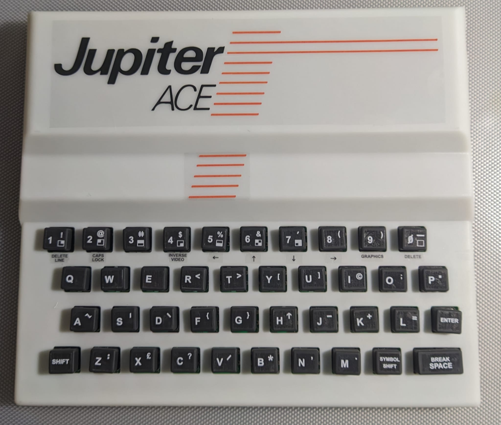

## FEATURES

- 3KB/19KB bytes of RAM selectable by a jumper
- Normal (black background) or inverse video (white background) selectable by a jumper
- composite video output
- Reset button
- 4+4 selectable ROMs
- Ace81 add-on (Beta)

## THE CIRCUIT

### THE MEMORY MAP
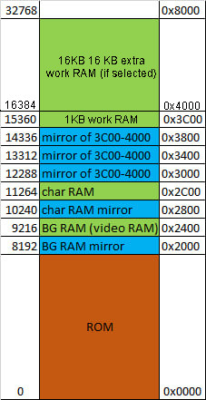

### WORK RAM

La memoria de trabajo es donde se almacenan todos los datos de programa.

En un Jupiter Ace estándar tenemos tan solo 1KB de memoria de trabajo, aunque existen modulos de ampliacion estándar de 16KB que nos permiten tener 17KB de memoria de trabajo.

El Mercury Ace dispone de un jumper (J3) que nos permite seleccionar entre 3KB de RAM y 19KB (1KB y 17KB de memoria de trabajo respectivamente)
 
 - 3KB (1KB Work RAM + 1KB Char RAM + 1KB BG RAM)
 - 19KB (17KB de Work RAM + 1KB Char RAM + 1KB BG RAM)

El chip Z29 es el responsable de generar la señal de habilitacion de la RAM de trabajo que se ubica a aprtir de la direccion 0x3C00, existiendo un 3 copias del primer K de esta memoria a partir de 0x3000.

Z29 decodifica A12-A14, y como solo se activa cuando A15 = 0 (G2B), solo se activa en los primeros 32K, y da una salida para cada región en estos rangos:

- Y0: 0K-4K
- Y1: 4K-8K
- Y2: 8K-12K
- Y3: 12K-16K
- Y4: 16K-20K
- Y5: 20K-24K
- Y6: 24K-28K
- Y7: 28K-32K

Las puertas Z30C y Z30D sirven para replicar los espejos del primer KB de la memoria de trabajo del circuito original en la zona de memoria 12K-16K. 

A14 indica si estamos en la zona 8-16K. Cuando A14 = 0, tienen que repetirse, por tanto se dejan fijos para que siempre se acceda a la misma RAM. 

- 3KB		/CE=!(!A14*A13*A12)

- 19KB	/CE=!((!A14*A13*A12) + A14)

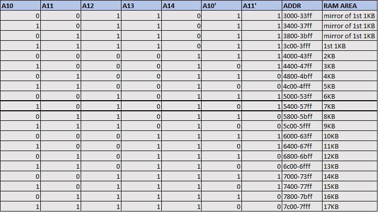

### BG RAM
La memoria de pantalla o BGRAM reside en el chip Z5-6. Como podemos ver en el mapa de memoria, ocupa los rangos de direcciones 0x2400..0x27ff y 0x2000..23ff (mirror). 

Las ecuaciones lógicas que gobiernan el chip son las siguientes:

Z29.Y2 = not (not A15 and not A14 and A13 and not A12)

R26.OUT = Z16.2Y2 + Z29.Y2

/WE1 = Z26.11

LECTURA
 | A11  | R26.out | /WE1 | CE(CHR) | CE2(BG)  | OE |
 | -----| --------| -----| --------| ---------| ---|
 |  0   |   0     |  1   |    1    |   0      |  0 |
 |  0   |   1     |  1   |    0    |   0      |  0 |
 |  1   |   0     |  1   |    0    |   1      |  0 |
 |  1   |   1     |  1   |    0    |   0      |  0 |

ESCRITURA
 | A11  | R26.out | /WE1 | CE(CHR) | CE2(BG)  | OE |
 | -----| --------|------| --------| ---------| ---|
 |  0   |   0     |  0   |    1    |   0      |  1 |
 |  0   |   1     |  1   |    0    |   0      |  0 |
 |  1   |   0     |  0   |    0    |   1      |  1 |
 |  1   |   1     |  1   |    0    |   0      |  0 |

La memoria de pantalla está configurada como un bloque de 32x24 caracteres lo que representa 768 bytes dejando 254 bytes sin usar al final de dicha memoria.

A este bloque podemos acceder tanto en lectura como en escritura.

Al bus de direcciones de este chip se accede desde la CPU a través de los chips Z15 y Z16 y desde el circuito de video a través de las resistencias R11 a R20.

El acceso desde la CPU o desde el circuito de video se arbitra con la señal /VHOLD

En la tabla de arriba podemos ver la lógica de la activación del chip.

El caso A11:R26.out:/WE1 = 1:1:1 en apariencia direcciona la BGRAM y la CHARRAM erroneamente cuando el procesador está accediendo a memoria fuera del area de video, pero gracias a las resistencias que hay situadas entre el bus de datos y la BGRAM se da preferencia a la WORKRAM y a la ROM.

### CHAR RAM

/WE1 = Z26.11

Laa memoria de caracteres o CHAR RAM ocupa los rangos de direcciones 0x2c00..0x2fff y 0x2800..0x2BFF (mirror), conteniendo un juego de 128 caracteres, lo que representa 128x8=1024 bytes.

La memoria se puede direccionar tanto desde la CPU como desde el circuito de video, pero la CPU solo puede acceder en modo escritura.

El motivo de esto último es que en el momento de la lectura, el bus de direcciones que entra desde Z17 y Z18 está conectado al bus de datos por un array de resistencias de 1KB y la salida que genera el chip también está conectado al mismo bus de datos por otro array de 1KB, debido a lo cual las direcciones se interfieren con los datos de salida generando lecturas erroneas.
Una idea para poder solucionar esto podría ser que el valor de resistencia del primer array (el de direcciones) fuera mayor que el del segundo array (datos) dando prioridad a este último, pero habría que experimentar y descartar otras consecuencias imprevistas.

Cuando se está accediendo a la CHARRAM por parte del circuito de video el bus de direcciones llega por dos vias:

- A4..A9 llegan desde la salida de datos de la BGRAM (D0..D6), que en ese momento contendrá el caracter que se está intentando visualizar.

- A0..A3 en el scanline del caracter que se esta visualizando actualmente y llegará desde la parte baja del contador de lineas (CNT9..CNT11).

Por otro lado el bit 7 del dato del codigo del caracter que viene desde la BGRAM se almacenará en el latch Z27B. Este bit se utilizará para invertir el video en Z23D en caso de que el bit sea 1.

Los bits 0 a 6 del codigo de caracter provenientes de la BGRAM se cargan en el serializador (Z28) cada vez que los tres bits bajos del contador horizontal están a cero (CNT0..CNT2), y los pixels van saliendo del chip con cada pulso de reloj, combinandose con el bit 7 (inverse) en la puerta Z23D.

### VIDEO RAM ACCESS PRIORITY
El circuito implementa un sistema de prioridades que permite dar acceso prioritario a la RAM de video (BGRAM + CHARRAM) a la CPU o al circuito de video.

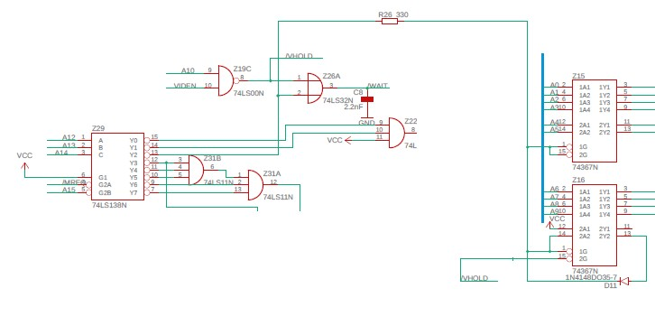

La memoria de video está duplicada en forma de mirror en dos zonas de memoria dependiendo del valor de A10.

La prioridad de acceso a la VRAM es distinta dependiendo de si accedemos al bloque principal (A10=1) o a su copia (A10=0).

Cuando accedemos a la memoria de video desde la CPU (A14:A13:A12 = 0:1:0)(salida de R26) y /VHOLD=1 Z15 y Z16 dejan pasar la direccion desde el bus.

Si el acceso ocurre siendo /VHOLD=0, el circuito pone a 1 la salida 2Y2 de Z16 aislando las señales del bus de direcciones y permitiendo el acceso desde el circuito de video.

Una vez puesta a 1 la señal se memoriza y se mantiene en ese estado hasta que /VHOLD sea de nuevo 1 momento en el que volverá a permitir el acceso desde la CPU.

Z29.Y2 = (A14:A13:A12 = 0:1:0)

 | /VHOLD  |   Z29.Y2   | Z16.2Y2 |   1G   | next 2Y2  | ADDR_OUT  |
 | --------| -----------| --------| -------| ----------| ----------|
 |    1    |      0     |    -    |    0   |     x     |    ADDR   |
 |    1    |      1     |    -    |    1   |     x     |     x     |
 |    0    |      0     |    0    |    0   |     0     |    ADDR   |
 |    0    |      1     |    0    |    1   |     1     |     x     |
 |    0    |      -     |    1    |    1   |     1     |     x     |
 

Para que /VHOLD sea igual a 0 A10 debe ser igual a 1, que corresponde a la copia superior de la RAM de video.  /VHOLD activa tambien un mecanismo por el que implementa un estado de espera en la CPU a traves de la señal de /WAIT del Z80 para evitar interferencias con el circuito de video.

Sin embargo si A10=0 (copia inferior) no activaremos la señal de /VHOLD y por tanto podremos consultar la RAM gracias a que las resistencias R11 a R20 le daran prioridad a la CPU, por lo que en este caso interferiremos en la visualizacion pudiendo mostrar basura en la pantalla durante el acceso.

/WAIT = /VHOLD + Z29.Y2

/VHOLD = !VIDEN + !A10 (/VHOLD activo (=0) cuando VIDEN=0 y A10=0)

### VIDEO CIRCUIT

El circuito de generacion de video se basa en dos contadores de 9 bits generados con los chips Z9, Z10 y Z11:

El contador de pixeles horizontal corresponde con las señales CNT0..CNT8.

El contador de líneas corresponde con las señales CNT9..CNT17.

A partir de los contadores el circuito genera dos señales principales; LINE y FIELD.

La señal LINE (Z22.12) se activa para indicar el final de cada linea cuanto el contador horizontal está entre 320 y 351:

    LINE= !CNT5*!CNT7*CNT6*CNT8		
	
La señal FIELD se activa para indicar el final de la visualizacion de un fotograma cuando el contador de lineas está entre 248 y 255:

    FIELD=CNT12*CNT13*CNT14*CNT15*CNT16
	

Adicionalmente, la señal VIDEN indica cuando se está representando el rectangulo que contiene los caracteres, delimitado entre 0 y 255 para el contador horizontal y entre 0 y 191 para el contador de lineas.
 
    VIDEN = !(CNT16*CNT15)*!(CNT17+CNT8)
 
 | CNT16   | CNT15  | Línea     |
 | --------| -------| ----------|
 |   0     |   0    |  0-63     |
 |   0     |   1    |  64-127   |
 |   1     |   0    |  128-191  |
 |   1     |   1    |  192-255  |
 
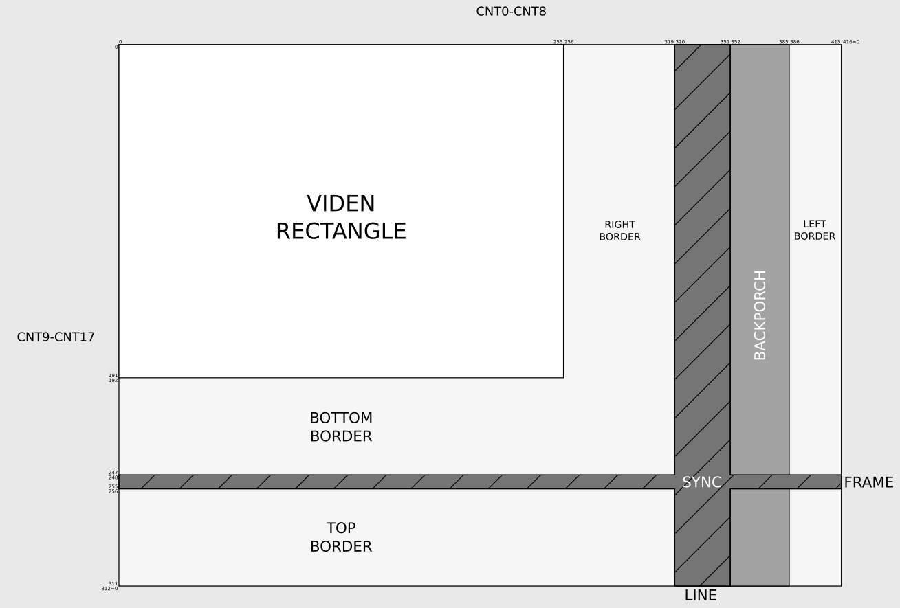
 
La secuencia de visualizacion comienza con el contador de pixeles y el contador de lineas a cero, una combinacion de bits del contador de lineas y el contador de pixeles determina la posicion del primer caracter a visualizar en la BGRAM.
1) Para ello se direcciona la BGRAM con los bits CNT3,4,5,6,7,12,13,14,15,16 con lo que la obtenemos el código del caracter por los pines D0..D7 del chip.

2) El código del caracter devuelto por el chip junto con los tres bits inferiores del contador de lineas (CNT9..11) son utilizados para direccionar el chip Z7-8 y obtener el scanline con la definicion del caracter que es cargado en el serializador Z28.

3) El bit 7 del código del caracter (bit de inverse) es almacenado en Z27B para combinarlo con los bits del scanline a través de Z23D.

4) A partir de ese momento a cada ciclo de reloj un bit del contenido del serializador sale por el pin 13 del mismo y es invertido o no en Z23D dependiendo del contenido de Z27B y enviado al display.

5) Cuando el valor de CNT0..2 vuelve a ser 0 se carga un nuevo codigo de caracter y se empieza por el primer scanline de dicho caracter. Este proceso se repite enviando al monitor 32 caracteres.

6) Tras esto se envian los pixeles correspondientes al borde derecho.

7) Desde 320 a 351 (LINE) se genera una señal de SYNC (pulso positivo).

8) Entre 352 y 385 generamos la señal de Backporch.

9) Entre 386 y 416 se pinta el borde derecho.

10) El contador se vuelve a poner a 0.

11) La secuencia anterior (2-10) se repite para el siguiente scanline hasta un total de 8 (CNT9..11=111b) momento en que pasamos a direccionar la siguiente linea en la BGRAM

12) Después de visualizar 24 lineas (contador de lineas=192) pasamos al borde inferior de la pantalla, generando la señal FIELD entre el valor 248 y 255 lo que provoca una nueva señal SYNC. Adicionalmente se genera una interrupcion en el Z80 /INT=0.

13) Finalmente se genera el borde superior de la pantalla entre 256 y 311.

14) cuando el contador de lineas alcanza el valor 312 se pone de nuevo a 0 y comenzamos la visualizacion de un nuevo frame.

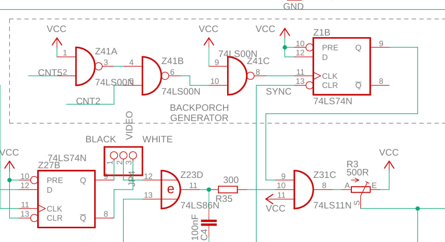

BACKPORCH = !CNT5*CNT2 desde el último SYNC

### ACE81 ADDON

## ASSEMBLY
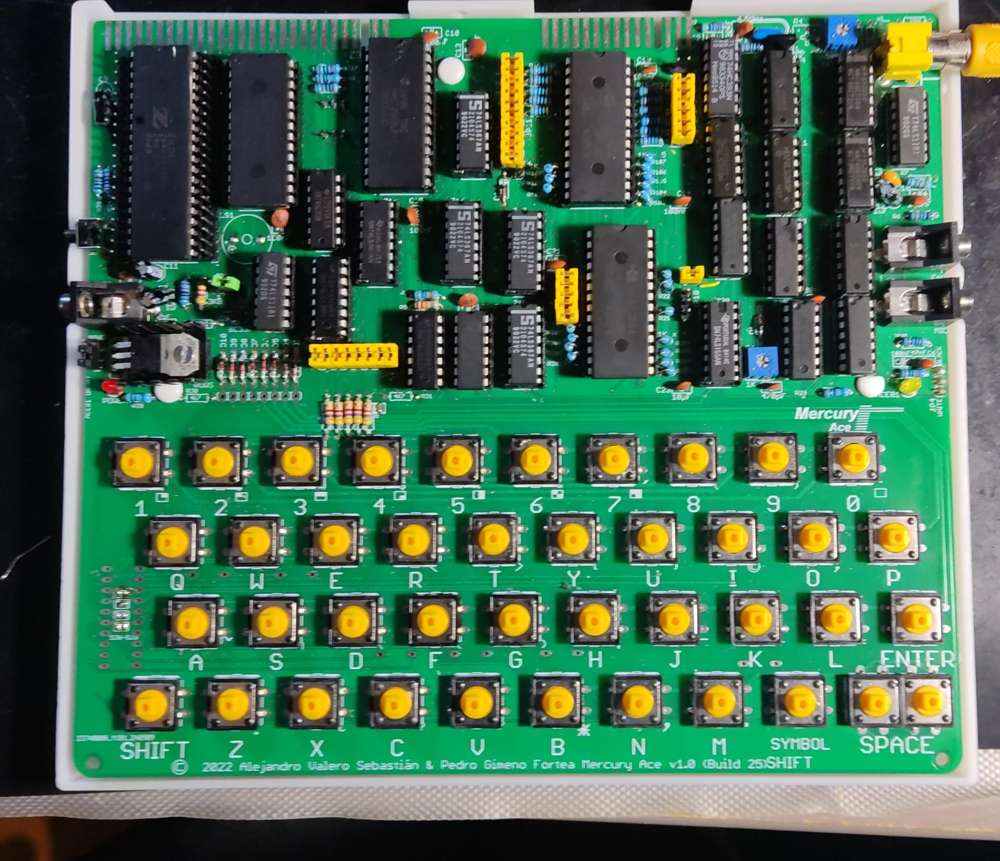

Components that should not be put in or changed in the JA

- C4 – Do not put
- U2,R4,R32,R33,R34 – Do not put if SJ1 closes (video option)
- JP9 – Do not close if the Ace81 board is not in place
- SJ2-SJ9 – Close if the Ace81 board is not in place
- R30 & R31 – Do not put on if the Ace81 board is not in place
- D12.. D17 – install a 0R instead the diodes if the Ace81 board is not on

We have the following options when building the board:

Installation of op-amp for video:

The SJ1 bridge is the one that will allow us to select whether to install the op-amp circuit or bypass it.

With the bridge open, the video will pass through the components of the op-amp and therefore we will need to install the following components:

-	U2
-	R4
-	R32
-	R33
-	R34

If you decide not to use the op-amp, you must close SJ1 with a drop of tin and not solder the aforementioned components.

Installing the Ace81 add-on module:

The Ace81 Add-On module is a circuit that is currently in Beta. This circuit modifies the Jupiter Ace's hardware to simulate a zx81, modifying the video generation circuit and keyboard order.

In the module we have a selector that will allow us to switch between Jupiter Ace mode and Ace81 mode.

If we want to have this add-on we must install the following components:

- R30, R31, D12, D13, D14, D15, D16, D17 y Z40

The GAL JED file (Z40) is available in the GAL folder.

Additionally, the Add-on board will have to be manufactured and connected on the pins located around the Z5-6 RAM (JP10x, JP15x, JP6 and JP8)

Put JP9 on 1-2 (Keyboard Auto)

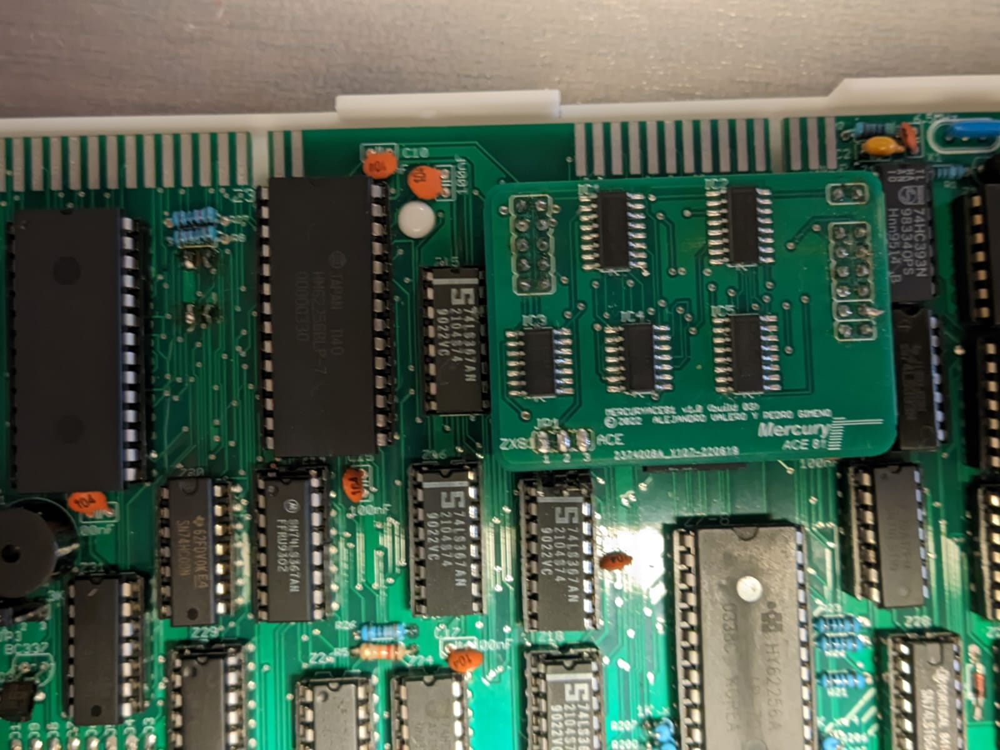

This mode requires a modified ROM for its proper functioning that is included inside the ROM folder.

The GAL must be welded without a socket as it does not fit inside the housing along with it.

If you do not use the Ace81 mode, you must take into account the following:

Install the following components: R30, R31, D12, D13, D14, D15, D16, D17, and Z40.

Close the JP10x, JP15x, JP6 and JP8 jumpers.

Close the SJ2 jumpers with a drop of tin. SJ9

## PARTLIST

### CLONE

 |Part	                               |Value   |Device     |Package    |Description	  |NO ACE81	     |ACE81	 |SJ1 CLOSED |SJ1 OPENED |
 | ------------------------------------| -------| ----------| ----------| ----------------| -------------| ------| ----------| ----------| 
 |K1..K41		                       |        |PUSH BUTTON|B3F-40     |OMRON	          |     Y        |  Y    |   Y       |   Y       |
 |R26,R35                              | 330R   |RESISTOR   |0204/7     |                 |	    Y		 |  Y    |   Y       |   Y       |
 |R26	                               | 300R   |RESISTOR   |0204/7     |                 |	    Y		 |  Y    |   Y       |   Y       |			
 |R28,R29                              | 680R   |RESISTOR   |0204/7     |                 |	    Y		 |  Y    |   Y       |   Y       |			
 |R32                                  | ???    |RESISTOR   |0204/7     |                 |	     		 |       |   N       |   Y       |			
 |R33                                  | ???    |RESISTOR   |0204/7     |                 |	     		 |       |   N       |   Y       |			
 |R34                                  | ???    |RESISTOR   |0204/7     |                 |	     		 |       |   N       |   Y       |			
 |R8,R10,R24,R27,R39,R42               | 10K    |RESISTOR   |0204/7     |                 |	    Y		 |  Y    |   Y       |   Y       |			
 |R5                                   | 12K    |RESISTOR   |0204/7     |                 |	    Y		 |  Y    |   Y       |   Y       |			
 |R3                                   | 500R   |POT        |EU-B25P    | POTENTIOMETER   |	    Y		 |  Y    |   Y       |   Y       |			
 |R4                                   | 1K     |POT        |EU-B25P    | POTENTIOMETER   |	    Y		 |  Y    |   Y       |   Y       |			
 |R1,R6,R11..R23,R100..R107,R200,R207  | 1K     |RESISTOR   |0204/7     |                 |	     		 |       |   N       |   Y       |			
 |R9                                   | 22K    |RESISTOR   |0204/7     |                 |	    Y		 |  Y    |   Y       |   Y       |			
 |R7                                   | 33K    |RESISTOR   |0204/7     |                 |	    Y		 |  Y    |   Y       |   Y       |			
 |R2                                   | 47K    |RESISTOR   |0204/7     |                 |	    Y		 |  Y    |   Y       |   Y       |			
 |R30,R31,R36..R38,R40,R41             | 4K7    |RESISTOR   |0204/7     |                 |	    Y		 |  Y    |   Y       |   Y       |			
 |RN1 (alt to R36,R37,R38,R40,R41)     | 4K7    |RNET       |RN-6       | RESISTOR NET    |	    Y		 |  Y    |   Y       |   Y       |			
 |C4 (DO NOT INSTALL)                  |        |CAPACITOR  |025X50     | CERAMIC  CAP.   |	    N		 |  N    |   N       |   N       |			
 |C10,C13..C21                         | 100nF  |CAPACITOR  |025X50     | CERAMIC  CAP.   |	    Y		 |  Y    |   Y       |   Y       |			
 |C2                                   | 100pF  |CAPACITOR  |025X50     | CERAMIC  CAP.   |	    Y		 |  Y    |   Y       |   Y       |			
 |C9                                   | 100uF  |CAPACITOR  |RADIAL     | POL. CAPACITOR  |	    Y		 |  Y    |   Y       |   Y       |			
 |C7,C11,C12                           | 1uF    |CAPACITOR  |RADIAL     | POL. CAPACITOR  |	    Y		 |  Y    |   Y       |   Y       |			
 |C3,C8                                | 2.2nF  |CAPACITOR  |025X50     | CERAMIC  CAP.   |	    Y		 |  Y    |   Y       |   Y       |			
 |C1                                   | 30pF   |CAPACITOR  |025X50     | CERAMIC  CAP.   |	    Y		 |  Y    |   Y       |   Y       |			
 |C22                                  | 470pF  |CAPACITOR  |025X50     | CERAMIC  CAP.   |	    Y		 |  Y    |   Y       |   Y       |			
 |C6                                   | 47nF   |CAPACITOR  |025X50     | CERAMIC  CAP.   |	    Y		 |  Y    |   Y       |   Y       |			
 |C5                                   | 47pF   |CAPACITOR  |025X50     | CERAMIC  CAP.   |	    Y		 |  Y    |   Y       |   Y       |			
 |D1..D11                              | 1N4148 |DIODE      |DO35-7     | SIGNAL DIODE    |	    Y		 |  Y    |   Y       |   Y       |			
 |D12..D17                             | 1N4148 |DIODE      |DO35-7     | SIGNAL DIODE    | REP.WITH 0R  |  Y    |           |           |			
 |U1                                   | 7805   |REGULATOR  |TO220      | 5V REGULATOR    |      Y       |  Y    |   Y       |   Y       |			
 |Z1-2                                 | 27C512 |EEPROM     |DIL28W     | 64KB x 8 BITS   |      Y       |  Y    |   Y       |   Y       |			
 |Q1                                   | 2N3904 |TRANSISTOR |TO92       | NPN             |      Y       |  Y    |   Y       |   Y       |			
 |X1                                   | 6.5MHZ |CRISTAL    |HC49U      |                 |      Y       |  Y    |   Y       |   Y       |			
 |Z0                                   | Z80A   |CPU        |DIL40      |                 |      Y       |  Y    |   Y       |   Y       |			
 |Z1-2                                 | 27C512 |EEPROM     |DIL28W     | 64KB x 8 BITS   |      Y       |  Y    |   Y       |   Y       |			
 |Z1,Z27                               | 74LS74 |74XX       |DIL14      | DUAL D-FLIP FLOP|      Y       |  Y    |   Y       |   Y       |			
 |Z3-4,Z5-6,Z7-8                       | 62256  |SRAM       |DIL28W     | 32KB x 8 BITS   |      Y       |  Y    |   Y       |   Y       |			
 |Z9,Z10,Z11                           | 74LS393|74XX       |DIL14      | DUAL BIN.COUNTER|      Y       |  Y    |   Y       |   Y       |			
 |Z14..Z18                             | 74LS367|74XX       |DIL16      | 3-STATE BUFFER  |      Y       |  Y    |   Y       |   Y       |			
 |Z19,Z30,Z41                          | 74LS00 |74XX       |DIL14      | 4xNAND GATES    |      Y       |  Y    |   Y       |   Y       |			
 |Z20                                  | 74LS08 |74XX       |DIL14      | 4xAND GATES     |      Y       |  Y    |   Y       |   Y       |			
 |Z21,Z22,Z31                          | 74LS11 |74XX       |DIL14      | 3xAND GATES     |      Y       |  Y    |   Y       |   Y       |			
 |Z23                                  | 74LS86 |74XX       |DIL14      | 4xXOR GATES     |      Y       |  Y    |   Y       |   Y       |			
 |Z24,Z25                              | 74LS02 |74XX       |DIL14      | 4xNOR GATES     |      Y       |  Y    |   Y       |   Y       |			
 |Z26                                  | 74LS32 |74XX       |DIL14      | 4xOR GATES      |      Y       |  Y    |   Y       |   Y       |			
 |Z29                                  | 74LS138|74XX       |DIL16      | DECODER         |      Y       |  Y    |   Y       |   Y       |			
 |Z28                                  | 74LS166|74XX       |DIL16      | 8BIT SHIFT REG. |      Y       |  Y    |   Y       |   Y       |			
 |Z40                                  | GAL16V8|GAL        |DIL20      | GAL16V8         |      N       |  Y    |           |           |			
 |LED1                                 | RED    |LED        |3MM        | POWER LED       |      Y       |  Y    |   Y       |   Y       |			
 |LED2                                 | YELLOW |LED        |3MM        | ACE81 LED       |      N       |  Y    |           |           |			
 |Q3                                   | BC337  |TRANSISTOR |TO92       | NPN             |      Y       |  Y    |   Y       |   Y       |			
 |X2                                   | YELLOW |CONNECTOR  |AV-8.4-5   | 3 PINS          |      Y       |  Y    |   Y       |   Y       |			
 |LS1                                  | 16R    |BUZZER     |           | PASIVE BUZZER   |      Y       |  Y    |   Y       |   Y       |			
 |U2                                   | MAX4390|           |SOT95P280  | op-amp          |              |       |   Y       |   N       |			
 |EAR,MIC,POWER	JACK                   | 3.5mm  |CONNECTOR  |PJ302M     | FEM. 3.5mm JACK |      Y       |  Y    |   Y       |   Y       |			
 |S2				                   |        |BUTTON     |B3F-31XX   | PUSH BUTTON 90º |      Y       |  Y    |   Y       |   Y       |			
 |S1				                   | DS02   |DIPSWITCH  |DS-02      | ROM SELECTOR    |      Y       |  Y    |   Y       |   Y       |			

### ACE81
 |Part	                               |Value   |Device     |Package    |Description	  |
 | ------------------------------------| -------| ----------| ----------| ----------------| 
 |IC1,IC2,IC5	                       | 74LS283|74XX       |SOP16      |4bit bin. adder  |
 |IC3,IC4		                       | 74LS08 |74XX       |SOP14      |4xAND gates      |

## THE CASE
La carcasa del clon está basada en un diseño inicial de Cees Meijer, modificado posteriormente por mi para adaptarlo a mi clon.
La placa del Mercury Ace está diseñada para poder sustituir a la placa del Jupiter Ace original, encajando perfectamente en su carcasa.
De la misma manera, he modificado el modelo de Cees meijer para que sea lo más parecido posible a la carcasa original y sea tambien capaz de albergar tanto la placa del clon como una placa original de Jupiter Ace.

Los archivos STL ya listos para imprimir están disponibles en la carpeta STL. La carcasa de la fotografía de la portada está impresa en resina 9000x y estoy muy contento con el resultado.
La carcasa consta de dos piezas que deben ser impresas en blanco. 

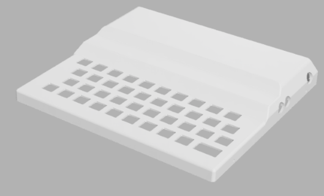
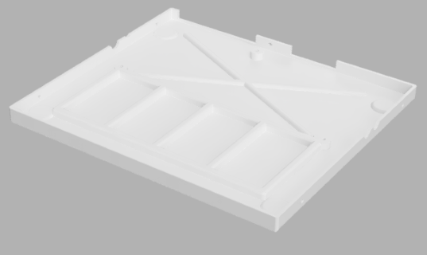

Para las teclas necesitaremos tres copias impresas del archivo "keys (without space key).stl" y una copia del archivo "keys (with space key).stl". Con ello conseguiremos las 40 teclas necesarias.

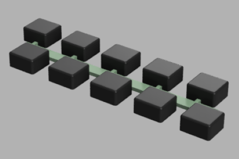
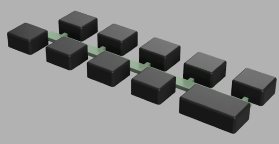

Los remaches necesarios son como los de la foto. Debemos buscarlos en las tiendas online como remaches de nylon referencia R3100 para sujetar la placa a la carcasa y R3065 para los que unen las dos partes de la carcasa.

Las pegatinas de la carcasa las tenemos disponibles en el archivo de Adobe Illustrator "teclado_cuadriculado v2 (1).ai". 
Deberemos imprimir el archivo en plastico adhesivo trasparente y utilizar una impresora capaz de imprimir con tinta blanca.

## REFERENCES

## ACKNOWLEDGEMENTS
Richard Altwasser y Steven Vickers por diseñar tan maravillosa máquina
Pedro Gimeno por su ayuda desinteresada y por el diseño del Ace81 y la ROM modificada
Paul Andrews (actual propietario de la marca Jupiter Ace) por permitir el desarrollo del clon
Cees Meijer por facilitarme el diseño inicial de la carcasa

