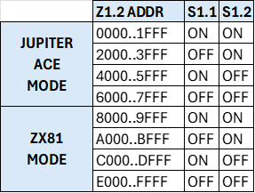
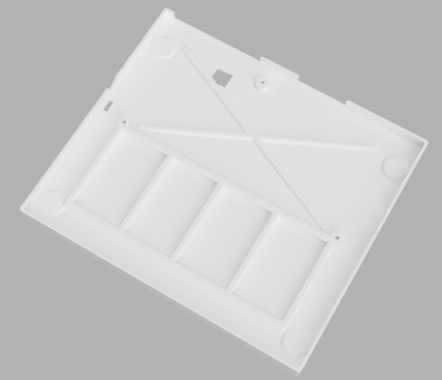

# Mercury Ace - Un clon de Jupiter Ace

[English version](README.md)

[Versión en Español](LEEME.md)


Un proyecto abierto tanto en hardware como en software


## CARACTERÍSTICAS

- 3KB/19KB bytes de RAM seleccionables mediante un jumper
- Normal (fondo negro) o video inverso (fondo blanco) seleccionable mediante un jumper
- Salida de video compuesto
- Boton de reset
- 4+4 ROMs seleccionables
- Ace81 add-on (Beta)

## EL CIRCUITO

### EL MAPA DE MEMORIA


### WORK RAM


La memoria de trabajo es donde se almacenan todos los datos de programa.

En un Jupiter Ace estándar tenemos tan solo 1KB de memoria de trabajo, aunque existen modulos de ampliacion estándar de 16KB que nos permiten tener 17KB de memoria de trabajo.

El Mercury Ace dispone de un jumper (J3) que nos permite seleccionar entre 3KB de RAM y 19KB (1KB y 17KB de memoria de trabajo respectivamente)
 
 - 3KB (1KB Work RAM + 1KB Char RAM + 1KB BG RAM)
 - 19KB (17KB de Work RAM + 1KB Char RAM + 1KB BG RAM)

El chip Z29 es el responsable de generar la señal de habilitacion de la RAM de trabajo que se ubica a aprtir de la direccion 0x3C00, existiendo un 3 copias del primer K de esta memoria a partir de 0x3000.


Z29 decodifica A12-A14, y como solo se activa cuando A15 = 0 (G2B), solo se activa en los primeros 32K, y da una salida para cada región en estos rangos:

- Y0: 0K-4K
- Y1: 4K-8K
- Y2: 8K-12K
- Y3: 12K-16K
- Y4: 16K-20K
- Y5: 20K-24K
- Y6: 24K-28K
- Y7: 28K-32K

Las puertas Z30C y Z30D sirven para replicar los espejos del primer KB de la memoria de trabajo del circuito original en la zona de memoria 12K-16K. 

A14 indica si estamos en la zona 8-16K. Cuando A14 = 0, tienen que repetirse, por tanto se dejan fijos para que siempre se acceda a la misma RAM. 

- 3KB		/CE=!(!A14*A13*A12)

- 19KB	/CE=!((!A14*A13*A12) + A14)


### BG RAM

La memoria de pantalla o BGRAM reside en el chip Z5-6. Como podemos ver en el mapa de memoria, ocupa los rangos de direcciones 0x2400..0x27ff y 0x2000..23ff (mirror). 

Las ecuaciones lógicas que gobiernan el chip son las siguientes:

Z29.Y2 = not (not A15 and not A14 and A13 and not A12)

R26.OUT = Z16.2Y2 + Z29.Y2


/WE1 = Z26.11

LECTURA

 | A11  | R26.out | /WE1 | CE(CHR) | CE2(BG)  | OE |
 | -----| --------| -----| --------| ---------| ---|
 |  0   |   0     |  1   |    1    |   0      |  0 |
 |  0   |   1     |  1   |    0    |   0      |  0 |
 |  1   |   0     |  1   |    0    |   1      |  0 |
 |  1   |   1     |  1   |    0    |   0      |  0 |

ESCRITURA

 | A11  | R26.out | /WE1 | CE(CHR) | CE2(BG)  | OE |
 | -----| --------|------| --------| ---------| ---|
 |  0   |   0     |  0   |    1    |   0      |  1 |
 |  0   |   1     |  1   |    0    |   0      |  0 |
 |  1   |   0     |  0   |    0    |   1      |  1 |
 |  1   |   1     |  1   |    0    |   0      |  0 |

La memoria de pantalla está configurada como un bloque de 32x24 caracteres lo que representa 768 bytes dejando 254 bytes sin usar al final de dicha memoria.

A este bloque podemos acceder tanto en lectura como en escritura.

Al bus de direcciones de este chip se accede desde la CPU a través de los chips Z15 y Z16 y desde el circuito de video a través de las resistencias R11 a R20.

El acceso desde la CPU o desde el circuito de video se arbitra con la señal /VHOLD

En la tabla de arriba podemos ver la lógica de la activación del chip.

El caso A11:R26.out:/WE1 = 1:1:1 en apariencia direcciona la BGRAM y la CHARRAM erroneamente cuando el procesador está accediendo a memoria fuera del area de video, pero gracias a las resistencias que hay situadas entre el bus de datos y la BGRAM se da preferencia a la WORKRAM y a la ROM.

### CHAR RAM

/WE1 = Z26.11

La memoria de caracteres o CHAR RAM ocupa los rangos de direcciones 0x2c00..0x2fff y 0x2800..0x2BFF (mirror), conteniendo un juego de 128 caracteres, lo que representa 128x8=1024 bytes.

La memoria se puede direccionar tanto desde la CPU como desde el circuito de video, pero la CPU solo puede acceder en modo escritura.

El motivo de esto último es que en el momento de la lectura, el bus de direcciones que entra desde Z17 y Z18 está conectado al bus de datos por un array de resistencias de 1KB y la salida que genera el chip también está conectado al mismo bus de datos por otro array de 1KB, debido a lo cual las direcciones se interfieren con los datos de salida generando lecturas erroneas.
Una idea para poder solucionar esto podría ser que el valor de resistencia del primer array (el de direcciones) fuera mayor que el del segundo array (datos) dando prioridad a este último, pero habría que experimentar y descartar otras consecuencias imprevistas.

Cuando se está accediendo a la CHARRAM por parte del circuito de video el bus de direcciones llega por dos vias:

- A4..A9 llegan desde la salida de datos de la BGRAM (D0..D6), que en ese momento contendrá el caracter que se está intentando visualizar.

- A0..A3 en el scanline del caracter que se esta visualizando actualmente y llegará desde la parte baja del contador de lineas (CNT9..CNT11).

Por otro lado el bit 7 del dato del codigo del caracter que viene desde la BGRAM se almacenará en el latch Z27B. Este bit se utilizará para invertir el video en Z23D en caso de que el bit sea 1.

Los bits 0 a 6 del codigo de caracter provenientes de la BGRAM se cargan en el serializador (Z28) cada vez que los tres bits bajos del contador horizontal están a cero (CNT0..CNT2), y los pixels van saliendo del chip con cada pulso de reloj, combinandose con el bit 7 (inverse) en la puerta Z23D.

### PRIORIDAD DE ACCESO A LA RAM DE VIDEO

El circuito implementa un sistema de prioridades que permite dar acceso prioritario a la RAM de video (BGRAM + CHARRAM) a la CPU o al circuito de video.


La memoria de video está duplicada en forma de mirror en dos zonas de memoria dependiendo del valor de A10.

La prioridad de acceso a la VRAM es distinta dependiendo de si accedemos al bloque principal (A10=1) o a su copia (A10=0).

Cuando accedemos a la memoria de video desde la CPU (A14:A13:A12 = 0:1:0)(salida de R26) y /VHOLD=1 Z15 y Z16 dejan pasar la direccion desde el bus.

Si el acceso ocurre siendo /VHOLD=0, el circuito pone a 1 la salida 2Y2 de Z16 aislando las señales del bus de direcciones y permitiendo el acceso desde el circuito de video.

Una vez puesta a 1 la señal se memoriza y se mantiene en ese estado hasta que /VHOLD sea de nuevo 1 momento en el que volverá a permitir el acceso desde la CPU.

Z29.Y2 = (A14:A13:A12 = 0:1:0)

 | /VHOLD  |   Z29.Y2   | Z16.2Y2 |   1G   | next 2Y2  | ADDR_OUT  |
 | --------| -----------| --------| -------| ----------| ----------|
 |    1    |      0     |    -    |    0   |     x     |    ADDR   |
 |    1    |      1     |    -    |    1   |     x     |     x     |
 |    0    |      0     |    0    |    0   |     0     |    ADDR   |
 |    0    |      1     |    0    |    1   |     1     |     x     |
 |    0    |      -     |    1    |    1   |     1     |     x     |
 


Para que /VHOLD sea igual a 0 A10 debe ser igual a 1, que corresponde a la copia superior de la RAM de video.  /VHOLD activa tambien un mecanismo por el que implementa un estado de espera en la CPU a traves de la señal de /WAIT del Z80 para evitar interferencias con el circuito de video.

Sin embargo si A10=0 (copia inferior) no activaremos la señal de /VHOLD y por tanto podremos consultar la RAM gracias a que las resistencias R11 a R20 le daran prioridad a la CPU, por lo que en este caso interferiremos en la visualizacion pudiendo mostrar basura en la pantalla durante el acceso.

/WAIT = /VHOLD + Z29.Y2

/VHOLD = !VIDEN + !A10 (/VHOLD activo (=0) cuando VIDEN=0 y A10=0)


### CIRCUITO DE VIDEO

El circuito de generacion de video se basa en dos contadores de 9 bits generados con los chips Z9, Z10 y Z11:

El contador de pixeles horizontal corresponde con las señales CNT0..CNT8.

El contador de líneas corresponde con las señales CNT9..CNT17.

A partir de los contadores el circuito genera dos señales principales; LINE y FIELD.

La señal LINE (Z22.12) se activa para indicar el final de cada linea cuanto el contador horizontal está entre 320 y 351:

    LINE= !CNT5*!CNT7*CNT6*CNT8		
	
La señal FIELD se activa para indicar el final de la visualizacion de un fotograma cuando el contador de lineas está entre 248 y 255:

    FIELD=CNT12*CNT13*CNT14*CNT15*CNT16
	


Adicionalmente, la señal VIDEN indica cuando se está representando el rectangulo que contiene los caracteres, delimitado entre 0 y 255 para el contador horizontal y entre 0 y 191 para el contador de lineas.
 
    VIDEN = !(CNT16*CNT15)*!(CNT17+CNT8)
 
 
 |CNT17    | CNT16   | CNT15  | Línea     | Comentario        |
 | --------| --------| -------| ----------|-------------------|
 |   0     |   0     |   0    |  0-63     | Parte de VIDEN    |
 |   0     |   0     |   1    |  64-127   | Parte de VIDEN    |
 |   0     |   1     |   0    |  128-191  | Parte de VIDEN    |
 |   0     |   1     |   1    |  192-255  | No parte de VIDEN |
 |   1     |   x     |   x    |  256-311  | No parte de VIDEN |
 
 | CNT8 | Pixel  | Comentario        |
 | -----| -------| ------------------|
 | 0    | 0-255  | Parte de VIDEN    |
 | 1    |256-415 | No parte de VIDEN |
  

 
La secuencia de visualizacion comienza con el contador de pixeles y el contador de lineas a cero, una combinacion de bits del contador de lineas y el contador de pixeles determina la posicion del primer caracter a visualizar en la BGRAM.

1) Para ello se direcciona la BGRAM con los bits CNT3,4,5,6,7,12,13,14,15,16 con lo que la obtenemos el código del caracter por los pines D0..D7 del chip.

2) El código del caracter devuelto por el chip junto con los tres bits inferiores del contador de lineas (CNT9..11) son utilizados para direccionar el chip Z7-8 y obtener el scanline con la definicion del caracter que es cargado en el serializador Z28.

3) El bit 7 del código del caracter (bit de inverse) es almacenado en Z27B para combinarlo con los bits del scanline a través de Z23D.

4) A partir de ese momento a cada ciclo de reloj un bit del contenido del serializador sale por el pin 13 del mismo y es invertido o no en Z23D dependiendo del contenido de Z27B y enviado al display.

5) Cuando el valor de CNT0..2 vuelve a ser 0 se carga un nuevo codigo de caracter y se empieza por el primer scanline de dicho caracter. Este proceso se repite enviando al monitor 32 caracteres.

6) Tras esto se envian los pixeles correspondientes al borde derecho.

7) Desde 320 a 351 (LINE) se genera una señal de SYNC (pulso positivo).

8) Entre 352 y 385 generamos la señal de Backporch.

9) Entre 386 y 415 se pinta el borde derecho.

10) El contador se vuelve a poner a 0.

11) La secuencia anterior (2-10) se repite para el siguiente scanline hasta un total de 8 (CNT9..11=111b) momento en que pasamos a direccionar la siguiente linea en la BGRAM

12) Después de visualizar 24 lineas (contador de lineas=192) pasamos al borde inferior de la pantalla, generando la señal FIELD entre el valor 248 y 255 lo que provoca una nueva señal SYNC. Adicionalmente se genera una interrupcion en el Z80 /INT=0.

13) Finalmente se genera el borde superior de la pantalla entre 256 y 311.

14) cuando el contador de lineas alcanza el valor 312 se pone de nuevo a 0 y comenzamos la visualizacion de un nuevo frame.


BACKPORCH = !CNT5*CNT2 desde el último SYNC

### EL TECLADO
El teclado consiste en una matriz de 40 teclas (5 filas x 8 columnas) dividida lógicamente en 8 semifilas de 5 columnas por semifila.
No sé si fue por una reordenacion posterior al diseño, pero el caso es que en el teclado del JA hay algunas teclas en las que no se corresponde su posicion física con la de su conexion lógica.
Concretamente el "SYMBOL SHIFT" tiene su conexion lógica en la segunda posicion de la semifila 0, junto al "SHIFT", sin embargo físicamente está situado justo antes de la tecla "SPACE" en la última semifila.


El puerto del teclado se decodifica con las puertas Z26B y Z26C lo que proporciona una decodificacion parcial del puerto 0xFE en lectura.
El chip Z14 que es un buffer triestado es el que controla el flujo de datos desde el teclado al bus de datos cuando se consulta el puerto 0xFE.


### ACE81 ADDON

¿qué es el ACE81 ADDON?
El ACE81 es un pqueño módulo que se pincha sobre la BGRAM y modifica ligeramente el hardware de control de la visualizacion para que sea capaz de gestionar un display como el de un ZX81.
El ZX81 hace un uso extensivo del procesador para generar el video, hasta tal punto que cerca de dos tercios del tiempo del procesador los usa para este fin.
El JA es una máquina muy parecida al ZX81 en muchos aspectos, pero con hardware de generacion de video, lo que hace que los 3.2MHz a los que funciona estén totalmente disponibles para nuestro programa.
La idea (y el diseño) del ACE81 surgió por parte Pedro Gimeno como un ejercicio de como hubiera sido un zx81 si, al igual que el JA, hubiera tenido un hardware dedicado para generar el video. 
Evidentemente hubiera sido una máquina mucho más rápida (o menos lenta, dependiendo de como lo queramos enfocar).
La idea al final es hacer funcionar una ROM de ZX81 en un JA, con las minimas modificaciones en dicha ROM para eliminar la parte de generacion de video.
Comparando la memoria de video del ZX81 y del JA nos damos cuenta que su disposicion es prácticamente igual:

Similitudes
- Ambos tienen 32x24 caracteres
- Ambos son en blanco y negro
- En ambos casos el bit 7 del codigo de caracter es "inverse video"

Diferencias
- El juego de caracteres del JA es de 128 elementos, mientras que en el ZX81 es de solo 64 debido a que el bit 6=1 sirve al firmware para detectar el fin de linea.
- En ZX81 cada linea está terminada en un HALT (cod=76h) (33x23=759 bytes) mientras que en JA no hay terminador de línea (736 bytes)

Partiendo de estas premisas la idea del Ace81 es hacer que la estructura de la memoria de video sea igual a la del zx81 cuando tenemos activado el modo ZX81 (33 bytes por línea), manteniendo la estructura estándar (32 bytes por linea) cuando está seleccionado el modo JA.

Aparte de las diferencias en el display, existe una pequeña diferencia en la distribución del teclado que obliga a modificar la circuiteria de este para mantener el orden fisico de las teclas.

Físicamente la disposicion de las teclas del ZX81 es identica a la del JA, sin embargo a diferencia del JA, en el ZX81 coincide la disposicion física con la lógica, lo que dificulta la compatibilidad a la hora de utilizar un teclado de JA con la ROM del ZX81.
Para sortear dicho problema hay que modificar el conexionado del teclado y añadir alguna lógica adicional que hemos decidido incluir en una GAL para facilitar el diseño.

Como he comentado antes los cambios se limitan a las dos semifilas de abajo (semifila 0 y semifila 7)

| Semifila| ZX81		   | Jupiter Ace						 |
|---------|----------------|-------------------------------------|
|    0    | "SHIFT Z    X C V"| SHIFT	SYMB	Z	X	C|
|    7    | "SPACE SYMB	N M B"| SPACE	N		M	B	V|

Pero ese pequeño cambio y hacer que ambos modos sean seleccionables, implica modificaciones importantes en la lógica de conexion del teclado, ya que cambia por completo la estructura de las semifilas 0 y 7.

Las ecuaciones que controlan ambos modos son las siguientes:

```
/** Logic Equations **/

   ZX81 = ACE81_ENABLED;
   Jupiter = !ACE81_ENABLED;
   
   ROW_SS = !((Jupiter & !ROW1) # (ZX81 & !ROW8)); 
   ROW_V = !((Jupiter & !ROW8) # (ZX81 & !ROW1)); 
   
   KEYB2 = !(Jupiter & !KM & !ROW8 # ZX81 & !KZ & !ROW1 );
   KEYB3 = !(Jupiter & (!KN & !ROW8 # !KZ & !ROW1) # ZX81 & (!KM & !ROW8 # !KX & !ROW1)); 
   KEYB4 = !(Jupiter & (!KB & !ROW8 # !KX & !ROW1) # ZX81 & (!KN & !ROW8 # !KC &!ROW1));
   KEYB5 = !(Jupiter & !KC & !ROW1 # ZX81 & !KB & !ROW8);
```

## MONTAJE


Componentes que no deben ser colocados o que deben ser cambiados durante el montaje.

- C4 – No colocar
- U2, R4, R32, R33, R34 – No colocar si SJ1 está cerrado (opción de video)
- JP9 – No cerrar si la placa Ace81 no está instalada
- SJ2-SJ9 – Cerrar si la placa Ace81 no está instalada
- R30 y R31 – No colocar si la placa Ace81 no está instalada
- D12.. D17 – Instalar un 0R en lugar de los diodos si la placa Ace81 no está instalada


Tenemos las siguientes opciones al ensamblar la placa:

Instalación del amplificador operacional para video:

El puente SJ1 es el que nos permitirá seleccionar si instalamos el circuito del amplificador operacional o lo omitimos.

Con el puente abierto, el video pasará a través de los componentes del amplificador operacional, por lo tanto, necesitaremos instalar los siguientes componentes:

- U2
- R4
- R32
- R33
- R34

Si decides no utilizar el amplificador operacional, debes cerrar SJ1 con una gota de estaño y no soldar los componentes mencionados.

Instalación del módulo adicional Ace81:

El módulo adicional Ace81 es un circuito que actualmente está en Beta. Este circuito modifica el hardware del Jupiter Ace para simular un zx81, modificando el circuito de generación de video y el orden del teclado.

En el módulo tenemos un selector que nos permitirá cambiar entre el modo Jupiter Ace y el modo Ace81.

Si queremos tener este complemento, debemos instalar los siguientes componentes:

- R30, R31, D12, D13, D14, D15, D16, D17 y Z40

El archivo JED de la GAL (Z40) está disponible en la carpeta GAL.

Además, será necesario fabricar y conectar la placa adicional en los pines ubicados alrededor de la RAM Z5-6 (JP10x, JP15x, JP6 y JP8).

JP9 es un selector alternativo en la placa principal para el modo ACE81, por lo que JP9 y el selector del Addon son mutuamente exclusivos, por lo que solo se debe utilizar uno de ellos, dejando el otro sin colocar.


Este modo requiere una ROM modificada para su correcto funcionamiento, que está incluida en la carpeta ROM.

La GAL debe ser soldada sin un zócalo, ya que no cabe dentro de la carcasa si se utiliza uno.

Si no usas el modo Ace81, debes tener en cuenta lo siguiente:

No instalar los siguientes componentes: R30, R31, D12, D13, D14, D15, D16, D17 y Z40.
Puentear D12, D13, D14, D15, D16 y D17.

Cierra los puentes JP10x, JP15x, JP6 y JP8.

Cierra los puentes SJ2 y SJ9 con una gota de estaño.

El clon permite disponer de 4 ROMs en modo Jupiter Ace y 4 ROMs en modo Ace81, seleccionables desde el DIPSwitch S1.

El selector de modo del addon cambiará automáticamente entre un bloque de 4 ROMs o el otro, mientras que S1 nos permitirá seleccionar manualmente cualquiera de las 4 ROMs.



## LISTADO DE COMPONENTES

### CLON

 |Part	                               |Value   |Device     |Package    |Description	  |NO ACE81	     |ACE81	 |SJ1 CLOSED |SJ1 OPENED |
 | ------------------------------------| -------| ----------| ----------| ----------------| -------------| ------| ----------| ----------| 
 |K1..K41		                       |        |PUSH BUTTON|B3F-40     |OMRON	          |     Y        |  Y    |   Y       |   Y       |
 |R26,R35                              | 330R   |RESISTOR   |0204/7     |                 |	    Y		 |  Y    |   Y       |   Y       |
 |R26	                               | 300R   |RESISTOR   |0204/7     |                 |	    Y		 |  Y    |   Y       |   Y       |			
 |R28,R29                              | 680R   |RESISTOR   |0204/7     |                 |	    Y		 |  Y    |   Y       |   Y       |			
 |R32                                  | ???    |RESISTOR   |0204/7     |                 |	     		 |       |   N       |   Y       |			
 |R33                                  | ???    |RESISTOR   |0204/7     |                 |	     		 |       |   N       |   Y       |			
 |R34                                  | ???    |RESISTOR   |0204/7     |                 |	     		 |       |   N       |   Y       |			
 |R8,R10,R24,R27,R39                   | 10K    |RESISTOR   |0204/7     |                 |	    Y		 |  Y    |   Y       |   Y       |			
 |R5                                   | 12K    |RESISTOR   |0204/7     |                 |	    Y		 |  Y    |   Y       |   Y       |			
 |R3                                   | 500R   |POT        |EU-B25P    | POTENTIOMETER   |	    Y		 |  Y    |   Y       |   Y       |			
 |R4                                   | 1K     |POT        |EU-B25P    | POTENTIOMETER   |	    Y		 |  Y    |   Y       |   Y       |			
 |R1,R6,R11..R23,R100..R107,R200,R207  | 1K     |RESISTOR   |0204/7     |                 |	     		 |       |   N       |   Y       |			
 |R42                                  | 1K     |RESISTOR   |0204/7     |                 |	     		 |       |   N       |   Y       |			
 |R9                                   | 22K    |RESISTOR   |0204/7     |                 |	    Y		 |  Y    |   Y       |   Y       |			
 |R7                                   | 33K    |RESISTOR   |0204/7     |                 |	    Y		 |  Y    |   Y       |   Y       |			
 |R2                                   | 47K    |RESISTOR   |0204/7     |                 |	    Y		 |  Y    |   Y       |   Y       |			
 |R30,R31                              | 4K7    |RESISTOR   |0204/7     |                 |	    N		 |  Y    |   Y       |   Y       |			
 |R36..R38,R40,R41                     | 4K7    |RESISTOR   |0204/7     |                 |	    Y		 |  Y    |   Y       |   Y       |			
 |RN1 (alt to R36,R37,R38,R40,R41)     | 4K7    |RNET       |RN-6       | RESISTOR NET    |	    Y		 |  Y    |   Y       |   Y       |			
 |C4 (DO NOT INSTALL)                  |        |CAPACITOR  |025X50     | CERAMIC  CAP.   |	    N		 |  N    |   N       |   N       |			
 |C10,C13..C21                         | 100nF  |CAPACITOR  |025X50     | CERAMIC  CAP.   |	    Y		 |  Y    |   Y       |   Y       |			
 |C2                                   | 100pF  |CAPACITOR  |025X50     | CERAMIC  CAP.   |	    Y		 |  Y    |   Y       |   Y       |			
 |C9                                   | 100uF  |CAPACITOR  |RADIAL     | POL. CAPACITOR  |	    Y		 |  Y    |   Y       |   Y       |			
 |C7,C11,C12                           | 1uF    |CAPACITOR  |RADIAL     | POL. CAPACITOR  |	    Y		 |  Y    |   Y       |   Y       |			
 |C3,C8                                | 2.2nF  |CAPACITOR  |025X50     | CERAMIC  CAP.   |	    Y		 |  Y    |   Y       |   Y       |			
 |C1                                   | 30pF   |CAPACITOR  |025X50     | CERAMIC  CAP.   |	    Y		 |  Y    |   Y       |   Y       |			
 |C22                                  | 470pF  |CAPACITOR  |025X50     | CERAMIC  CAP.   |	    Y		 |  Y    |   Y       |   Y       |			
 |C6                                   | 47nF   |CAPACITOR  |025X50     | CERAMIC  CAP.   |	    Y		 |  Y    |   Y       |   Y       |			
 |C5                                   | 47pF   |CAPACITOR  |025X50     | CERAMIC  CAP.   |	    Y		 |  Y    |   Y       |   Y       |			
 |D1..D11                              | 1N4148 |DIODE      |DO35-7     | SIGNAL DIODE    |	    Y		 |  Y    |   Y       |   Y       |			
 |D12..D17                             | 1N4148 |DIODE      |DO35-7     | SIGNAL DIODE    | REP.WITH 0R  |  Y    |           |           |			
 |U1                                   | 7805   |REGULATOR  |TO220      | 5V REGULATOR    |      Y       |  Y    |   Y       |   Y       |			
 |Z1-2                                 | 27C512 |EEPROM     |DIL28W     | 64KB x 8 BITS   |      Y       |  Y    |   Y       |   Y       |			
 |Q1                                   | 2N3904 |TRANSISTOR |TO92       | NPN             |      Y       |  Y    |   Y       |   Y       |			
 |X1                                   | 6.5MHZ |CRISTAL    |HC49U      |                 |      Y       |  Y    |   Y       |   Y       |			
 |Z0                                   | Z80A   |CPU        |DIL40      |                 |      Y       |  Y    |   Y       |   Y       |			
 |Z1-2                                 | 27C512 |EEPROM     |DIL28W     | 64KB x 8 BITS   |      Y       |  Y    |   Y       |   Y       |			
 |Z1,Z27                               | 74LS74 |74XX       |DIL14      | DUAL D-FLIP FLOP|      Y       |  Y    |   Y       |   Y       |			
 |Z3-4,Z5-6,Z7-8                       | 62256  |SRAM       |DIL28W     | 32KB x 8 BITS   |      Y       |  Y    |   Y       |   Y       |			
 |Z9,Z10,Z11                           | 74LS393|74XX       |DIL14      | DUAL BIN.COUNTER|      Y       |  Y    |   Y       |   Y       |			
 |Z14..Z18                             | 74LS367|74XX       |DIL16      | 3-STATE BUFFER  |      Y       |  Y    |   Y       |   Y       |			
 |Z19,Z30,Z41                          | 74LS00 |74XX       |DIL14      | 4xNAND GATES    |      Y       |  Y    |   Y       |   Y       |			
 |Z20                                  | 74LS08 |74XX       |DIL14      | 4xAND GATES     |      Y       |  Y    |   Y       |   Y       |			
 |Z21,Z22,Z31                          | 74LS11 |74XX       |DIL14      | 3xAND GATES     |      Y       |  Y    |   Y       |   Y       |			
 |Z23                                  | 74LS86 |74XX       |DIL14      | 4xXOR GATES     |      Y       |  Y    |   Y       |   Y       |			
 |Z24,Z25                              | 74LS02 |74XX       |DIL14      | 4xNOR GATES     |      Y       |  Y    |   Y       |   Y       |			
 |Z26                                  | 74LS32 |74XX       |DIL14      | 4xOR GATES      |      Y       |  Y    |   Y       |   Y       |			
 |Z29                                  | 74LS138|74XX       |DIL16      | DECODER         |      Y       |  Y    |   Y       |   Y       |			
 |Z28                                  | 74LS166|74XX       |DIL16      | 8BIT SHIFT REG. |      Y       |  Y    |   Y       |   Y       |			
 |Z40                                  | GAL16V8|GAL        |DIL20      | GAL16V8         |      N       |  Y    |           |           |			
 |LED1                                 | RED    |LED        |3MM        | POWER LED       |      Y       |  Y    |   Y       |   Y       |			
 |LED2                                 | YELLOW |LED        |3MM        | ACE81 LED       |      N       |  Y    |           |           |			
 |Q3                                   | BC337  |TRANSISTOR |TO92       | NPN             |      Y       |  Y    |   Y       |   Y       |			
 |X2                                   | YELLOW |CONNECTOR  |AV-8.4-5   | 3 PINS          |      Y       |  Y    |   Y       |   Y       |			
 |LS1                                  | 16R    |BUZZER     |           | PASIVE BUZZER   |      Y       |  Y    |   Y       |   Y       |			
 |U2                                   | MAX4390|           |SOT95P280  | op-amp          |              |       |   Y       |   N       |			
 |EAR,MIC,POWER	JACK                   | 3.5mm  |CONNECTOR  |PJ302M     | FEM. 3.5mm JACK |      Y       |  Y    |   Y       |   Y       |			
 |S2				                   |        |BUTTON     |B3F-31XX   | PUSH BUTTON 90º |      Y       |  Y    |   Y       |   Y       |			
 |S1				                   | DS02   |DIPSWITCH  |DS-02      | ROM SELECTOR    |      Y       |  Y    |   Y       |   Y       |			

### ACE81

 |Part	                               |Value   |Device     |Package    |Description	  |
 | ------------------------------------| -------| ----------| ----------| ----------------| 
 |IC1,IC2,IC5	                       | 74LS283|74XX       |SOP16      |4bit bin. adder  |
 |IC3,IC4		                       | 74LS08 |74XX       |SOP14      |4xAND gates      |


## LA CARCASA

La carcasa del clon está basada en un diseño inicial de Cees Meijer, modificado posteriormente por mi para adaptarlo a mi clon.

La placa del Mercury Ace está diseñada para poder sustituir a la placa del Jupiter Ace original, encajando perfectamente en su carcasa.

De la misma manera, he modificado el modelo de Cees meijer para que sea lo más parecido posible a la carcasa original y sea tambien capaz de albergar tanto la placa del clon como una placa original de Jupiter Ace.

Los archivos STL ya listos para imprimir están disponibles en la carpeta STL. La carcasa de la fotografía de la portada está impresa en resina 9000x y estoy muy contento con el resultado.

La carcasa consta de dos piezas que deben ser impresas en blanco. 

Para la parte inferior tenemos dos alternativas:

- El archivo "Jupiter ACE (bottom).stl" no deja acceso al DIP Switch del selector por lo que la estética será más parecida al original. Podemos dejar sin instalar el DIPSwitch y el clon arrancará seleccionando la ROM grabada en la parte mas baja del chip.
- El archivo "Jupiter ACE (bottom)(ROM selector).stl, deja una ventana para acceder al DIP Switch de la ROM y al selector del Ace81.




Para las teclas necesitaremos tres copias impresas del archivo "keys (without space key).stl" y una copia del archivo "keys (with space key).stl". Con ello conseguiremos las 40 teclas necesarias.


Los remaches necesarios son como los de la foto. Debemos buscarlos en las tiendas online como remaches de nylon referencia R3100 para sujetar la placa a la carcasa y R3065 para los que unen las dos partes de la carcasa.

Las pegatinas de la carcasa las tenemos disponibles en el archivo de Adobe Illustrator "teclado_cuadriculado v2 (1).ai". 

Deberemos imprimir el archivo en plastico adhesivo trasparente y utilizar una impresora capaz de imprimir con tinta blanca. El fondo azul es solo como referencia y no debe imprimirse.


## REFERENCIAS

https://en.wikipedia.org/wiki/Jupiter_Cantab

https://es.wikipedia.org/wiki/Jupiter_Ace

https://hackaday.io/project/165772-recreating-the-jupiter-ace

http://searle.x10host.com/JupiterAce/JupiterAce.html


## AGRADECIMIENTOS

Richard Altwasser y Steven Vickers por diseñar tan maravillosa máquina

Pedro Gimeno por su ayuda desinteresada y por el diseño del Ace81 y la ROM modificada

Paul Andrews (actual propietario de la marca Jupiter Ace) por permitir el desarrollo del clon

Cees Meijer por facilitarme el diseño inicial de la carcasa
