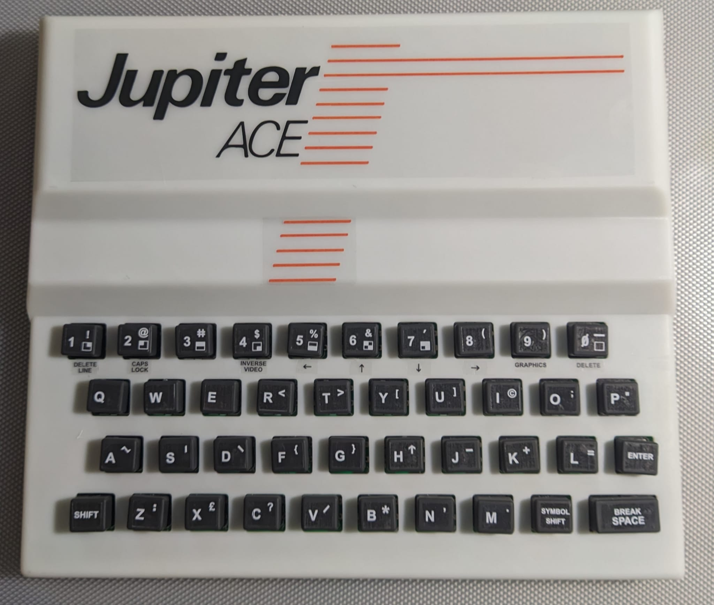
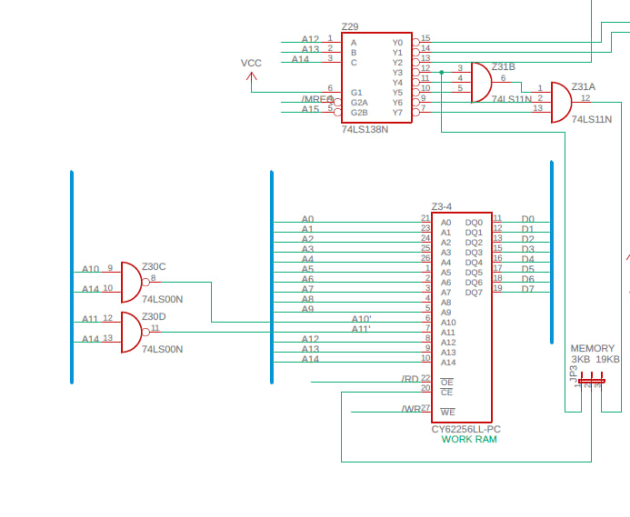
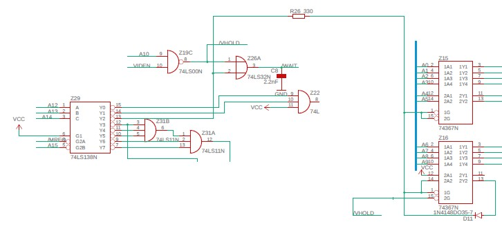
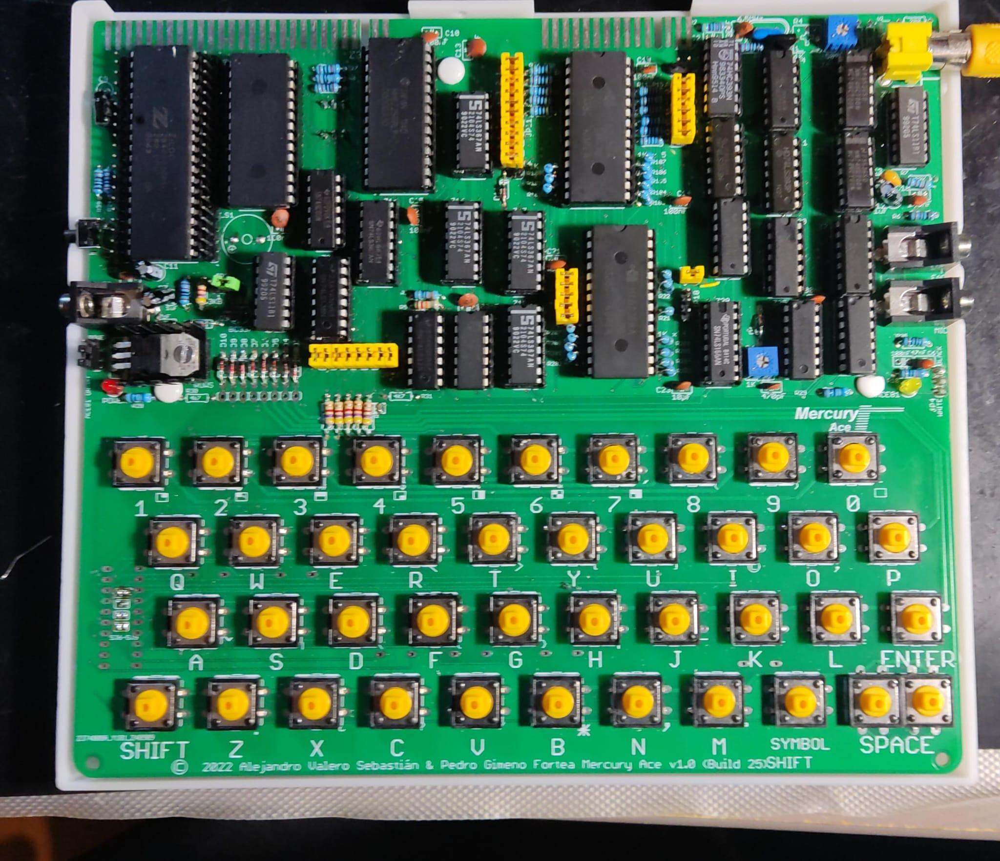
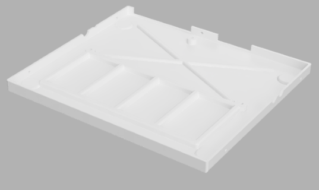
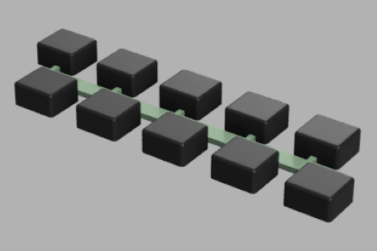
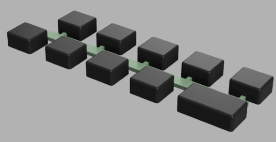

# Mercury Ace - a Jupiter Ace clone

[English version](README.md)

[Versión en Español](LEEME.md)

An open hardware and open source project 

## FEATURES

- 3KB/19KB bytes of RAM selectable by a jumper
- Normal (black background) or inverse video (white background) selectable by a jumper
- composite video output
- Reset button
- 4+4 selectable ROMs
- Ace81 add-on (Beta)

## THE CIRCUIT

### THE MEMORY MAP

### WORK RAM

The work memory is where all program data is stored.

In a standard Jupiter Ace, we have only 1KB of working memory, although there are standard 16KB expansion modules that allow us to have 17KB of working memory.

The Mercury Ace has a jumper (J3) that allows us to select between 3KB of RAM and 19KB (1KB and 17KB of working memory, respectively):

- 3KB (1KB Work RAM + 1KB Char RAM + 1KB BG RAM)
- 19KB (17KB Work RAM + 1KB Char RAM + 1KB BG RAM)

The Z29 chip is responsible for generating the enable signal for the working RAM, which is located starting at address 0x3C00. There are three copies of the first K of this memory starting from 0x3000.

Z29 decodes A12-A14, and since it only activates when A15 = 0 (G2B), it is only active in the first 32K, providing an output for each region within these ranges:

- Y0: 0K-4K
- Y1: 4K-8K
- Y2: 8K-12K
- Y3: 12K-16K
- Y4: 16K-20K
- Y5: 20K-24K
- Y6: 24K-28K
- Y7: 28K-32K

The Z30C and Z30D gates are used to replicate the mirrors of the first KB of the working memory from the original circuit in the 12K-16K memory area.

A14 indicates if we are in the 8-16K area. When A14 = 0, they need to be repeated, so they are fixed to always access the same RAM.

- 3KB		/CE=!(!A14*A13*A12)

- 19KB	/CE=!((!A14*A13*A12) + A14)

### BG RAM

The screen memory or BGRAM resides in the Z5-6 chip. As we can see in the memory map, it occupies the address ranges 0x2400..0x27ff and 0x2000..0x23ff (mirror).

The logical equations that govern the chip are as follows:

Z29.Y2 = not (not A15 and not A14 and A13 and not A12)

R26.OUT = Z16.2Y2 + Z29.Y2

/WE1 = Z26.11

READING

 | A11  | R26.out | /WE1 | CE(CHR) | CE2(BG)  | OE |
 | -----| --------| -----| --------| ---------| ---|
 |  0   |   0     |  1   |    1    |   0      |  0 |
 |  0   |   1     |  1   |    0    |   0      |  0 |
 |  1   |   0     |  1   |    0    |   1      |  0 |
 |  1   |   1     |  1   |    0    |   0      |  0 |

WRITTING

 | A11  | R26.out | /WE1 | CE(CHR) | CE2(BG)  | OE |
 | -----| --------|------| --------| ---------| ---|
 |  0   |   0     |  0   |    1    |   0      |  1 |
 |  0   |   1     |  1   |    0    |   0      |  0 |
 |  1   |   0     |  0   |    0    |   1      |  1 |
 |  1   |   1     |  1   |    0    |   0      |  0 |

The screen memory is configured as a block of 32x24 characters, which represents 768 bytes, leaving 254 bytes unused at the end of this memory.

This block can be accessed for both reading and writing.

The address bus of this chip is accessed from the CPU through the Z15 and Z16 chips and from the video circuit through resistors R11 to R20.

Access from the CPU or the video circuit is managed by the /VHOLD signal.

In the table above, we can see the logic for chip activation.

The case A11:R26.out:/WE1 = 1:1:1 appears to incorrectly address the BGRAM and CHARRAM when the processor is accessing memory outside the video area, but thanks to the resistors located between the data bus and the BGRAM, priority is given to the WORKRAM and ROM.

### CHAR RAM

/WE1 = Z26.11

The character memory, or CHAR RAM, occupies the address ranges 0x2c00..0x2fff and 0x2800..0x2BFF (mirror), containing a set of 128 characters, which represents 128x8=1024 bytes.

The memory can be addressed both from the CPU and the video circuit, but the CPU can only access it in write mode.

The reason for this is that during reading, the address bus entering from Z17 and Z18 is connected to the data bus through a 1KB resistor array, and the output generated by the chip is also connected to the same data bus through another 1KB array. As a result, the addresses interfere with the output data, generating incorrect readings. 

One possible solution could be to make the resistance value of the first array (address) higher than that of the second array (data), giving priority to the latter. However, this would need to be tested to rule out any unforeseen consequences.

When the video circuit is accessing the CHARRAM, the address bus arrives via two paths:

- A4..A9 come from the data output of the BGRAM (D0..D6), which at that moment will contain the character being displayed.

- A0..A3 correspond to the scanline of the character currently being displayed and will come from the lower part of the line counter (CNT9..CNT11).

Additionally, bit 7 of the character code data coming from the BGRAM will be stored in latch Z27B. This bit will be used to invert the video in Z23D if the bit is 1.

Bits 0 to 6 of the character code from the BGRAM are loaded into the serializer (Z28) each time the three lower bits of the horizontal counter are at zero (CNT0..CNT2), and the pixels are output from the chip with each clock pulse, combining with bit 7 (inverse) at the Z23D gate.

### VIDEO RAM ACCESS PRIORITY

The circuit implements a priority system that allows priority access to the video RAM (BGRAM + CHARRAM) to the CPU or the video circuit.

The video memory is duplicated in the form of a mirror in two memory zones depending on the value of A10.

The priority of access to the VRAM is different depending on whether we access the main block (A10=1) or its copy (A10=0).

When we access the video memory from the CPU (A14:A13:A12 = 0:1:0) (output of R26) and /VHOLD=1 Z15 and Z16 allow the address to pass from the bus.

If the access occurs with /VHOLD=0, the circuit sets the 2Y2 output of Z16 to 1, isolating the signals from the address bus and allowing access from the video circuit.

Once set to 1, the signal is memorized and remains in that state until /VHOLD is 1 again, at which point it will again allow access from the CPU.

Z29.Y2 = (A14:A13:A12 = 0:1:0)

 | /VHOLD  |   Z29.Y2   | Z16.2Y2 |   1G   | next 2Y2  | ADDR_OUT  |
 | --------| -----------| --------| -------| ----------| ----------|
 |    1    |      0     |    -    |    0   |     x     |    ADDR   |
 |    1    |      1     |    -    |    1   |     x     |     x     |
 |    0    |      0     |    0    |    0   |     0     |    ADDR   |
 |    0    |      1     |    0    |    1   |     1     |     x     |
 |    0    |      -     |    1    |    1   |     1     |     x     |
 

For /VHOLD to be equal to 0 A10 must be equal to 1, which corresponds to the upper copy of the video RAM. /VHOLD also activates a mechanism by which it implements a wait state in the CPU through the Z80 /WAIT signal to avoid interference with the video circuit.

However, if A10=0 (lower copy) we will not activate the /VHOLD signal and therefore we will be able to consult the RAM thanks to the fact that resistors R11 to R20 will give priority to the CPU, so in this case we will interfere with the display and may show garbage on the screen during access.

/WAIT = /VHOLD + Z29.Y2

/VHOLD = !VIDEN + !A10 (/VHOLD active (=0) when VIDEN=0 and A10=0)

### VIDEO CIRCUIT

The video generation circuit is based on two 9-bit counters generated with the Z9, Z10 and Z11 chips:

The horizontal pixel counter corresponds to the CNT0..CNT8 signals.

The line counter corresponds to the CNT9..CNT17 signals.

From the counters the circuit generates two main signals; LINE and FIELD.

The LINE signal (Z22.12) is activated to indicate the end of each line when the horizontal counter is between 320 and 351:

LINE= !CNT5*!CNT7*CNT6*CNT8

The FIELD signal is activated to indicate the end of the display of a frame when the line counter is between 248 and 255:

    FIELD=CNT12*CNT13*CNT14*CNT15*CNT16
	

Additionally, the VIDEN signal indicates when the rectangle containing the characters is being represented, delimited between 0 and 255 for the horizontal counter and between 0 and 191 for the line counter.
 
    VIDEN = !(CNT16*CNT15)*!(CNT17+CNT8)
 
 | CNT16   | CNT15  | Línea     |
 | --------| -------| ----------|
 |   0     |   0    |  0-63     |
 |   0     |   1    |  64-127   |
 |   1     |   0    |  128-191  |
 |   1     |   1    |  192-255  |
 

 
The display sequence starts with the pixel counter and the line counter being set to zero, a combination of bits from the line counter and the pixel counter determines the position of the first character to be displayed in the BGRAM.

1) To do this, the BGRAM is addressed with bits CNT3,4,5,6,7,12,13,14,15,16, which gives us the character code through pins D0..D7 of the chip.

2) The character code returned by the chip together with the three lower bits of the line counter (CNT9..11) are used to address chip Z7-8 and obtain the scanline with the definition of the character which is loaded into the serializer Z28.

3) Bit 7 of the character code (inverse bit) is stored in Z27B to be combined with the scanline bits through Z23D.

4) From that moment on, at each clock cycle, a bit of the serializer content is output through pin 13 of the same and is inverted or not in Z23D depending on the content of Z27B and sent to the display.

5) When the value of CNT0..2 is 0 again, a new character code is loaded and the first scanline of said character is started. This process is repeated, sending 32 characters to the monitor.

6) After this, the pixels corresponding to the right edge are sent.

7) From 320 to 351 (LINE) a SYNC signal (positive pulse) is generated.

8) Between 352 and 385 we generate the Backporch signal.

9) Between 386 and 416 the right edge is painted.

10) The counter is reset to 0.

11) The above sequence (2-10) is repeated for the next scanline up to a total of 8 (CNT9..11=111b) at which point we move on to addressing the next line in the BGRAM.

12) After displaying 24 lines (line counter=192) we move to the lower edge of the screen, generating the FIELD signal between the value 248 and 255 which causes a new SYNC signal. Additionally, an interrupt is generated in the Z80 /INT=0.

13) Finally, the upper edge of the screen is generated between 256 and 311.

14) When the line counter reaches the value 312 it is reset to 0 again and we begin displaying a new frame.

BACKPORCH = !CNT5*CNT2 desde el último SYNC

### ACE81 ADDON

## ASSEMBLY

Components that should be changed or should not be put in or changed during the assembly

- C4 – Do not put
- U2,R4,R32,R33,R34 – Do not put if SJ1 closes (video option)
- JP9 – Do not close if the Ace81 board is not in place
- SJ2-SJ9 – Close if the Ace81 board is not in place
- R30 & R31 – Do not put on if the Ace81 board is not in place
- D12.. D17 – install a 0R instead the diodes if the Ace81 board is not on

We have the following options when building the board:

Installation of op-amp for video:

The SJ1 bridge is the one that will allow us to select whether to install the op-amp circuit or bypass it.

With the bridge open, the video will pass through the components of the op-amp and therefore we will need to install the following components:

-	U2
-	R4
-	R32
-	R33
-	R34

If you decide not to use the op-amp, you must close SJ1 with a drop of tin and not solder the aforementioned components.

Installing the Ace81 add-on module:

The Ace81 Add-On module is a circuit that is currently in Beta. This circuit modifies the Jupiter Ace's hardware to simulate a zx81, modifying the video generation circuit and keyboard order.

In the module we have a selector that will allow us to switch between Jupiter Ace mode and Ace81 mode.

If we want to have this add-on we must take in acount the follwing:

Do not install the following components: R30, R31, D12, D13, D14, D15, D16, D17, and Z40.
Bridge D12, D13, D14, D15, D16, and D17.

The JED file for the GAL(Z40) is available in the GAL folder.

Additionally, the Add-on board will have to be manufactured and connected on the pins located around the Z5-6 RAM (JP10x, JP15x, JP6 and JP8)

Put JP9 on 1-2 (Keyboard Auto)

This mode requires a modified ROM for its proper functioning that is included inside the ROM folder.

The GAL must be welded without a socket as it does not fit inside the housing along with it.

If you do not use the Ace81 mode, you must take into account the following:

Install the following components: R30, R31, D12, D13, D14, D15, D16, D17, and Z40.

Close the JP10x, JP15x, JP6 and JP8 jumpers.

Close the SJ2 jumpers with a drop of tin. SJ9

The clone allows you to have 4 ROMs in Jupiter Ace mode and 4 ROMs in Ace81 mode, selectable from the DIPSwitch S1.

The addon's mode selector will automatically switch between one block of 4 ROMs or the other, while S1 will allow you to manually select any of the 4 ROMs.

## PARTLIST

### CLONE

 |Part	                               |Value   |Device     |Package    |Description	  |NO ACE81	     |ACE81	 |SJ1 CLOSED |SJ1 OPENED |
 | ------------------------------------| -------| ----------| ----------| ----------------| -------------| ------| ----------| ----------| 
 |K1..K41		                       |        |PUSH BUTTON|B3F-40     |OMRON	          |     Y        |  Y    |   Y       |   Y       |
 |R26,R35                              | 330R   |RESISTOR   |0204/7     |                 |	    Y		 |  Y    |   Y       |   Y       |
 |R26	                               | 300R   |RESISTOR   |0204/7     |                 |	    Y		 |  Y    |   Y       |   Y       |			
 |R28,R29                              | 680R   |RESISTOR   |0204/7     |                 |	    Y		 |  Y    |   Y       |   Y       |			
 |R32                                  | ???    |RESISTOR   |0204/7     |                 |	     		 |       |   N       |   Y       |			
 |R33                                  | ???    |RESISTOR   |0204/7     |                 |	     		 |       |   N       |   Y       |			
 |R34                                  | ???    |RESISTOR   |0204/7     |                 |	     		 |       |   N       |   Y       |			
 |R8,R10,R24,R27,R39,R42               | 10K    |RESISTOR   |0204/7     |                 |	    Y		 |  Y    |   Y       |   Y       |			
 |R5                                   | 12K    |RESISTOR   |0204/7     |                 |	    Y		 |  Y    |   Y       |   Y       |			
 |R3                                   | 500R   |POT        |EU-B25P    | POTENTIOMETER   |	    Y		 |  Y    |   Y       |   Y       |			
 |R4                                   | 1K     |POT        |EU-B25P    | POTENTIOMETER   |	    Y		 |  Y    |   Y       |   Y       |			
 |R1,R6,R11..R23,R100..R107,R200,R207  | 1K     |RESISTOR   |0204/7     |                 |	     		 |       |   N       |   Y       |			
 |R9                                   | 22K    |RESISTOR   |0204/7     |                 |	    Y		 |  Y    |   Y       |   Y       |			
 |R7                                   | 33K    |RESISTOR   |0204/7     |                 |	    Y		 |  Y    |   Y       |   Y       |			
 |R2                                   | 47K    |RESISTOR   |0204/7     |                 |	    Y		 |  Y    |   Y       |   Y       |			
 |R30,R31,R36..R38,R40,R41             | 4K7    |RESISTOR   |0204/7     |                 |	    Y		 |  Y    |   Y       |   Y       |			
 |RN1 (alt to R36,R37,R38,R40,R41)     | 4K7    |RNET       |RN-6       | RESISTOR NET    |	    Y		 |  Y    |   Y       |   Y       |			
 |C4 (DO NOT INSTALL)                  |        |CAPACITOR  |025X50     | CERAMIC  CAP.   |	    N		 |  N    |   N       |   N       |			
 |C10,C13..C21                         | 100nF  |CAPACITOR  |025X50     | CERAMIC  CAP.   |	    Y		 |  Y    |   Y       |   Y       |			
 |C2                                   | 100pF  |CAPACITOR  |025X50     | CERAMIC  CAP.   |	    Y		 |  Y    |   Y       |   Y       |			
 |C9                                   | 100uF  |CAPACITOR  |RADIAL     | POL. CAPACITOR  |	    Y		 |  Y    |   Y       |   Y       |			
 |C7,C11,C12                           | 1uF    |CAPACITOR  |RADIAL     | POL. CAPACITOR  |	    Y		 |  Y    |   Y       |   Y       |			
 |C3,C8                                | 2.2nF  |CAPACITOR  |025X50     | CERAMIC  CAP.   |	    Y		 |  Y    |   Y       |   Y       |			
 |C1                                   | 30pF   |CAPACITOR  |025X50     | CERAMIC  CAP.   |	    Y		 |  Y    |   Y       |   Y       |			
 |C22                                  | 470pF  |CAPACITOR  |025X50     | CERAMIC  CAP.   |	    Y		 |  Y    |   Y       |   Y       |			
 |C6                                   | 47nF   |CAPACITOR  |025X50     | CERAMIC  CAP.   |	    Y		 |  Y    |   Y       |   Y       |			
 |C5                                   | 47pF   |CAPACITOR  |025X50     | CERAMIC  CAP.   |	    Y		 |  Y    |   Y       |   Y       |			
 |D1..D11                              | 1N4148 |DIODE      |DO35-7     | SIGNAL DIODE    |	    Y		 |  Y    |   Y       |   Y       |			
 |D12..D17                             | 1N4148 |DIODE      |DO35-7     | SIGNAL DIODE    | REP.WITH 0R  |  Y    |           |           |			
 |U1                                   | 7805   |REGULATOR  |TO220      | 5V REGULATOR    |      Y       |  Y    |   Y       |   Y       |			
 |Z1-2                                 | 27C512 |EEPROM     |DIL28W     | 64KB x 8 BITS   |      Y       |  Y    |   Y       |   Y       |			
 |Q1                                   | 2N3904 |TRANSISTOR |TO92       | NPN             |      Y       |  Y    |   Y       |   Y       |			
 |X1                                   | 6.5MHZ |CRISTAL    |HC49U      |                 |      Y       |  Y    |   Y       |   Y       |			
 |Z0                                   | Z80A   |CPU        |DIL40      |                 |      Y       |  Y    |   Y       |   Y       |			
 |Z1-2                                 | 27C512 |EEPROM     |DIL28W     | 64KB x 8 BITS   |      Y       |  Y    |   Y       |   Y       |			
 |Z1,Z27                               | 74LS74 |74XX       |DIL14      | DUAL D-FLIP FLOP|      Y       |  Y    |   Y       |   Y       |			
 |Z3-4,Z5-6,Z7-8                       | 62256  |SRAM       |DIL28W     | 32KB x 8 BITS   |      Y       |  Y    |   Y       |   Y       |			
 |Z9,Z10,Z11                           | 74LS393|74XX       |DIL14      | DUAL BIN.COUNTER|      Y       |  Y    |   Y       |   Y       |			
 |Z14..Z18                             | 74LS367|74XX       |DIL16      | 3-STATE BUFFER  |      Y       |  Y    |   Y       |   Y       |			
 |Z19,Z30,Z41                          | 74LS00 |74XX       |DIL14      | 4xNAND GATES    |      Y       |  Y    |   Y       |   Y       |			
 |Z20                                  | 74LS08 |74XX       |DIL14      | 4xAND GATES     |      Y       |  Y    |   Y       |   Y       |			
 |Z21,Z22,Z31                          | 74LS11 |74XX       |DIL14      | 3xAND GATES     |      Y       |  Y    |   Y       |   Y       |			
 |Z23                                  | 74LS86 |74XX       |DIL14      | 4xXOR GATES     |      Y       |  Y    |   Y       |   Y       |			
 |Z24,Z25                              | 74LS02 |74XX       |DIL14      | 4xNOR GATES     |      Y       |  Y    |   Y       |   Y       |			
 |Z26                                  | 74LS32 |74XX       |DIL14      | 4xOR GATES      |      Y       |  Y    |   Y       |   Y       |			
 |Z29                                  | 74LS138|74XX       |DIL16      | DECODER         |      Y       |  Y    |   Y       |   Y       |			
 |Z28                                  | 74LS166|74XX       |DIL16      | 8BIT SHIFT REG. |      Y       |  Y    |   Y       |   Y       |			
 |Z40                                  | GAL16V8|GAL        |DIL20      | GAL16V8         |      N       |  Y    |           |           |			
 |LED1                                 | RED    |LED        |3MM        | POWER LED       |      Y       |  Y    |   Y       |   Y       |			
 |LED2                                 | YELLOW |LED        |3MM        | ACE81 LED       |      N       |  Y    |           |           |			
 |Q3                                   | BC337  |TRANSISTOR |TO92       | NPN             |      Y       |  Y    |   Y       |   Y       |			
 |X2                                   | YELLOW |CONNECTOR  |AV-8.4-5   | 3 PINS          |      Y       |  Y    |   Y       |   Y       |			
 |LS1                                  | 16R    |BUZZER     |           | PASIVE BUZZER   |      Y       |  Y    |   Y       |   Y       |			
 |U2                                   | MAX4390|           |SOT95P280  | op-amp          |              |       |   Y       |   N       |			
 |EAR,MIC,POWER	JACK                   | 3.5mm  |CONNECTOR  |PJ302M     | FEM. 3.5mm JACK |      Y       |  Y    |   Y       |   Y       |			
 |S2				                   |        |BUTTON     |B3F-31XX   | PUSH BUTTON 90º |      Y       |  Y    |   Y       |   Y       |			
 |S1				                   | DS02   |DIPSWITCH  |DS-02      | ROM SELECTOR    |      Y       |  Y    |   Y       |   Y       |			

### ACE81

 |Part	                               |Value   |Device     |Package    |Description	  |
 | ------------------------------------| -------| ----------| ----------| ----------------| 
 |IC1,IC2,IC5	                       | 74LS283|74XX       |SOP16      |4bit bin. adder  |
 |IC3,IC4		                       | 74LS08 |74XX       |SOP14      |4xAND gates      |

## THE CASE

The clone case is based on an initial design by Cees Meijer, later modified by me to fit my clone.

The Mercury Ace plate is designed to be able to replace the plate of the original Jupiter Ace, fitting perfectly into its case.

In the same way, I have modified the Cees Meijer model to be as similar as possible to the original case and also be able to house both the clone plate and an original Jupiter Ace plate.

The ready-to-print STL files are available in the STL folder. The case in the cover photo is printed in 9000x resin and I am very happy with the result.

The case consists of two pieces that must be printed in white.

For the keys we will need three printed copies of the file "keys (without space key).stl" and one copy of the file "keys (with space key).stl". This will give us the 40 keys we need.

The rivets needed are like the ones in the photo. We must look for them in online stores as nylon rivets reference R3100 to hold the plate to the case and R3065 for those that join the two parts of the case.

The case stickers are available in the Adobe Illustrator file "teclado_cuadriculado v2 (1).ai".

We must print the file on transparent adhesive plastic and use a printer capable of printing with white ink.

## REFERENCES

https://en.wikipedia.org/wiki/Jupiter_Cantab

https://es.wikipedia.org/wiki/Jupiter_Ace

https://hackaday.io/project/165772-recreating-the-jupiter-ace

http://searle.x10host.com/JupiterAce/JupiterAce.html

## ACKNOWLEDGEMENTS

Richard Altwasser and Steven Vickers for designing such a wonderful machine

Pedro Gimeno for his selfless help and for the design of the Ace81 and the modified ROM

Paul Andrews (current owner of the Jupiter Ace brand) for allowing the development of the clone

Cees Meijer for providing me with the initial design of the case

